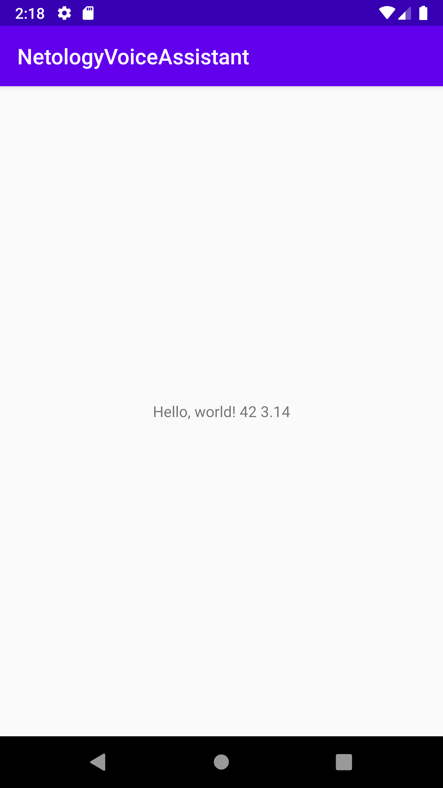

# Домашнее задание к занятию 1. Знакомство с Kotlin и Android Studio 

Мы начинаем разработку нашего Android приложения. Для начала установим Android Studio и создадим наше первое приложение.


## Задание 1
Скачайте и установите Android Studio. Инструкция доступна по ссылке: 

Создайте приложение и эмулятор, запустите на нем приложение. Инструкция доступна по ссылке:

Создайте строковую переменную и выведем ее на экран.То есть самостоятельно повторите все, что мы делали на лекции.

Пример ввода-вывода программы: 
```

```

## Задание 2
Программистам часто приходится заниматься отладкой программного кода, то есть поиском и исправлением ошибок (или, другими словами, багов). Для этого необходимо уметь выводить дополнительную информацию о работе программы в logcat.

Выведите дополнительную информацию о работе программы в logcat с помощью функций Log.d (рекомендуем поэкспериментировать с Log.e, Log.w).

Добавьте лог текста start of onCreate function как первую строку функции onCreate и строку end of onCreate function как последнюю.

```
override fun onCreate(savedInstanceState: Bundle?) {
    Log.d("netology voice", "start of onCreate function")
    ...
    ...
    ...
    Log.d("netology voice", "end of onCreate function")
}
```

Запустите приложение и убелимся, что в логах есть эти строки.

## Инструкция по выполнению домашнего задания

1. Зарегистрируйтесь на сайте ...

Любые вопросы по решению задач задавайте в чате в Telegram.
