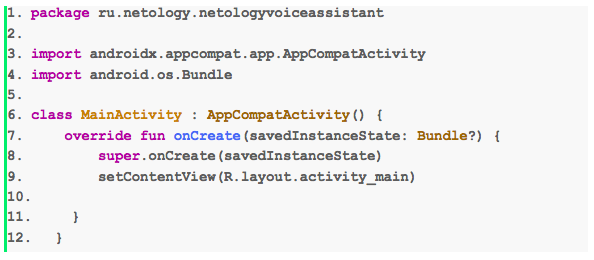
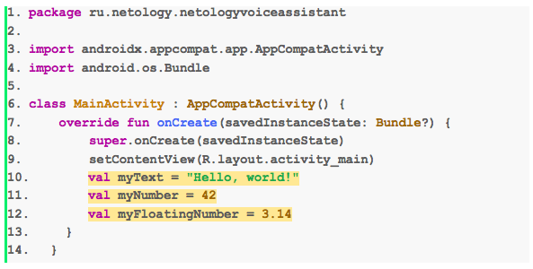
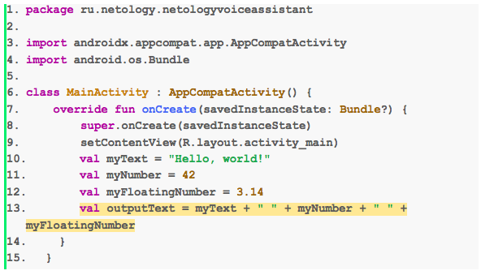
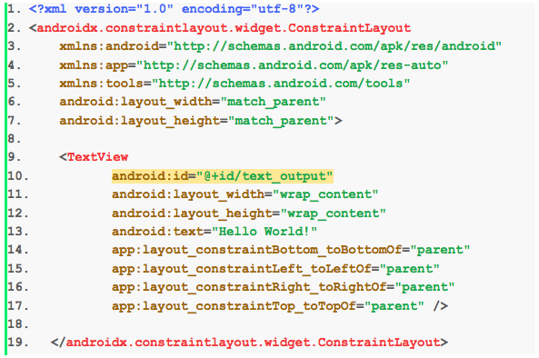
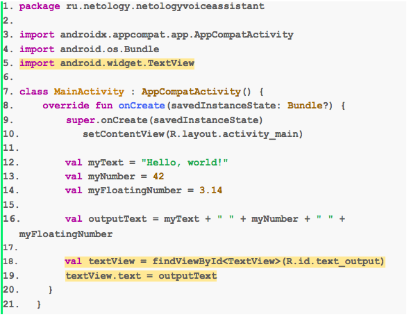
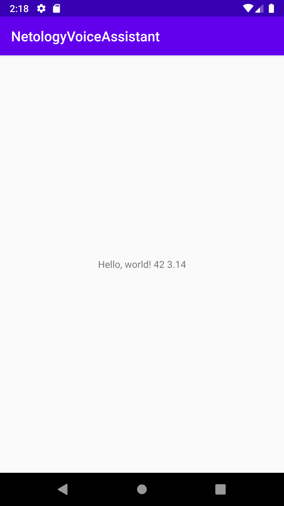
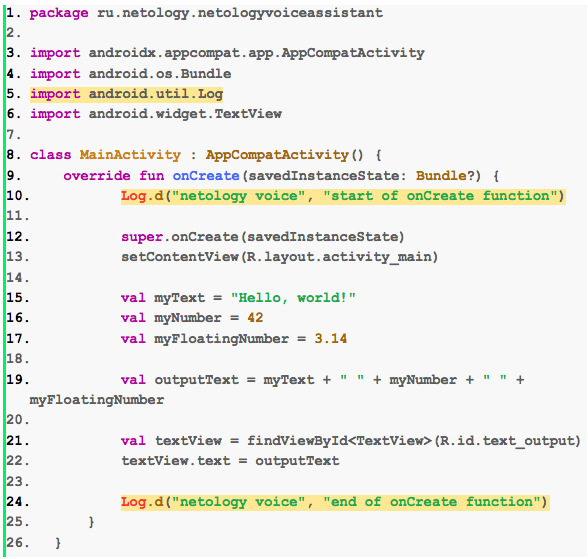

# Домашнее задание к занятию 1. Знакомство с Kotlin и Android Studio 

Мы начинаем разработку Android-приложения. Как оно будет работать? Мы будем задавать любой вопрос приложению голосом или текстом на английском языке. Приложение в свою очередь будет выдавать нам ответ текстом также на английском языке.

Для начала установим **Android Studio** и создадим наше первое приложение.


## Задание 1
Скачайте и установите **Android Studio**. Создайте приложение и эмулятор, запустите на нем приложение. Инструкции доступны по [ссылке](https://github.com/netology-code/guides/blob/master/android/instruction.md) .

## Задание 2

Создайте строковую переменную и выведите её на экран.

### Инструкция 
1. Запустите Android Studio. Перейдите в файл **MainActivity.kt** с помощью поиска (двойное нажатие на Shift). В файле MainActivity.kt  вы увидите такой код:



2. Создайте 3 новые переменные: строку, целое число и дробное число. Код, который необходимо добавлять на каждом шаге, выделен желтым цветом. Скопировать код вы можете из раздела **Итоговый код**.



3. Создайте строку с текстом. Этот текст в дальнейшем будет выводиться на экран. 



4. Перейдите в файл **activity_main.xml**  и добавьте идентификатор: ``` android:id="@+id/text_output" ``` (с его помощью можно работать с элементом интерфейса в коде).



5. Перейдите в файл **MainActivity.kt**. Используйте атрибут id, который вы добавили на предыдущем шаге. Для отображения текста в TextView присвойте значение текста параметру text элемента TextView. Для того, чтобы программа работала корректно, добавьте ```import android.widget.TextView```.



### Итоговый код в файле MainActivity.kt:

```kotlin
package ru.netology.netologyvoiceassistant

import androidx.appcompat.app.AppCompatActivity
import android.os.Bundle
import android.widget.TextView

class MainActivity : AppCompatActivity() {
    override fun onCreate(savedInstanceState: Bundle?) {
        super.onCreate(savedInstanceState)
        setContentView(R.layout.activity_main)

        val myText = "Hello, world!"
        val myNumber = 42
        val myFloatingNumber = 3.14

        val outputText = myText + " " + myNumber + " " + myFloatingNumber

        val textView = findViewById<TextView>(R.id.text_output)
        textView.text = outputText
    }
}
```

### Итоговый вид приложения:




## Задание 3 (дополнительное задание)

Программистам часто приходится заниматься отладкой программного кода, то есть поиском и исправлением ошибок (другими словами, багов). Для этого необходимо уметь выводить дополнительную информацию о работе программы в `logcat`.

Выведите дополнительную информацию о работе программы в `logcat` с помощью функций `Log.d` (рекомендуем поэкспериментировать с `Log.e`, `Log.w`).

Добавьте лог текста `start of onCreate function`, как первую строку функции `onCreate`, и строку `end of onCreate function`, как последнюю. 
```kotlin
override fun onCreate(savedInstanceState: Bundle?) {
    Log.d("netology voice", "start of onCreate function")
    ...
    ...
    ...
    Log.d("netology voice", "end of onCreate function")
}
```

Не забудте импортировать функцию `Log.d`. 

```kotlin
import android.util.Log
```

Код, который необходимо добавить в вашу программу, выделен желтым цветом:



Запустите приложение и убедитесь, что в логах есть эти строки.

Любые вопросы по решению задач задавайте в чате в Telegram.
