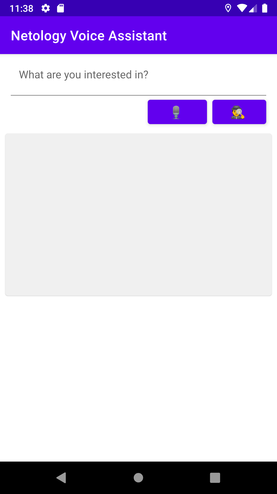

# Домашнее задание к занятию 2. Пользовательский интерфейс 

Пора создать интерфейс нашего приложения. Воспользуемся дизайн-системой Material Design от Google и специальной Android библиотекой компонентов.

## Задание 1
Добавим свою верхнюю панель, поле ввода вопроса, кнопку голосового ввода, кнопку поиска и панель вывода ответа по аналогии с лекцией.

Пример ввода-вывода программы: 
```

```

## Задание 2

Давайте сделаем одну из самых популярных анимаций в Materila design.

Увеличим высоту верхней панели и перенесем поле ввода и кнопки туда.

Карточку ответа оставим под верхней панелью.

Если прокрутить экран вниз, то верхняя манель будет сжиматься с анимацией, поле ввода будет скрываться. Если прокрутить обратно вверх - поле ввода будет показываться с анимацией.

Пример ввода-вывода программы: 
```

```

## Задание 3

## Инструкция по выполнению домашнего задания

1. Зарегистрируйтесь на сайте ...

Любые вопросы по решению задач задавайте в чате в Telegram.
