# Домашнее задание к занятию 2. Пользовательский интерфейс 
Какое современное приложение может обойтись без удобного интерфейса и крутого дизайна? В этом домашнем задании вам предстоит добавить новые объекты для взаимодействия с пользователем с помощью Material Design Components. 

## Задание 1
Добавьте бибилиотеку Material Design Components в ваш проект. Инструкция доступна по [ссылке.](https://github.com/netology-code/guides/blob/master/android/MaterialDesign/instruction.md) 

## Задание 2
Добавьте в приложение верхнюю панель, поле ввода под этой панелью, две Material кнопки и карточку для вывода ответа. После выполнения домашнего задания ваше приложение будет выглядеть так: 


### Инструкция 
1. Откройте файл `activity_main.xml`. В нем находится следующий код:

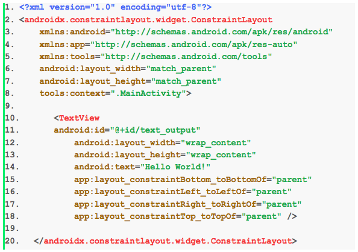

2. Добавьте следующий код как первый элемент корневого элемента `androidx.constraintlayout.widget.ConstraintLayout`:

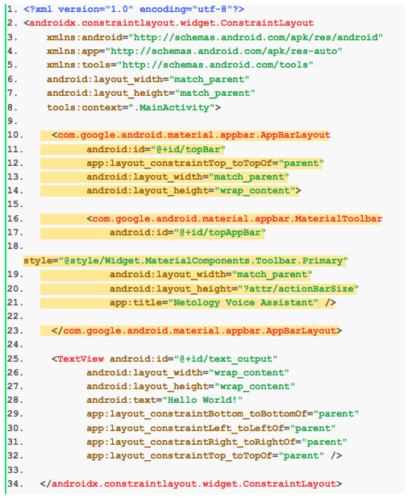

Код, который необходимо добавить, вы можете скопировать здесь:
```xml
  <com.google.android.material.appbar.AppBarLayout
        android:id="@+id/topBar"
        app:layout_constraintTop_toTopOf="parent"
        android:layout_width="match_parent"
        android:layout_height="wrap_content">
 
        <com.google.android.material.appbar.MaterialToolbar
            android:id="@+id/topAppBar"
            style="@style/Widget.MaterialComponents.Toolbar.Primary"
            android:layout_width="match_parent"
            android:layout_height="?attr/actionBarSize"
            app:title="Netology Voice Assistant" />
 
  </com.google.android.material.appbar.AppBarLayout>
```

3.  Откройте файл `MainActivity.kt`. Установите только что добавленный элемент, как верхнюю панель с помощью кода выделенного желтым цветом, старый код удалите.

``` Kotlin
setSupportActionBar(findViewById(R.id.topAppBar))
```

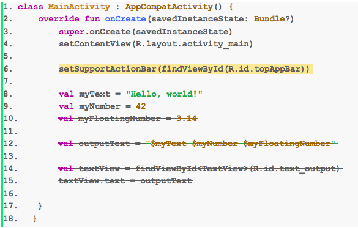

4. Откройте файл настроек проекта `AndroidManifest.xml` , чтобы установить специальную тему.

```xml
android:theme="@style/Theme.MaterialComponents.Light.NoActionBar">
```

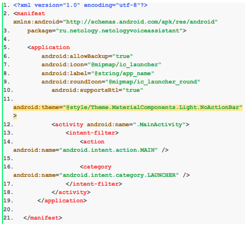

5. Откройте файл `activity_main.xml`. Добавьте поле ввода под верхней панелью в приложении, для этого добавьте код, выделенный желтым цветом.

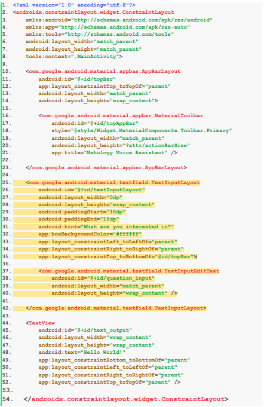

Код, который необходимо добавить, вы можете скопировать здесь:
```xml
<com.google.android.material.textfield.TextInputLayout
        android:id="@+id/textInputLayout"
        android:layout_width="0dp"
        android:layout_height="wrap_content"
        android:paddingStart="16dp"
        android:paddingEnd="16dp"
        android:hint="What are you interested in?"
        app:boxBackgroundColor="#ffffff"
        app:layout_constraintLeft_toLeftOf="parent"
        app:layout_constraintRight_toRightOf="parent"
        app:layout_constraintTop_toBottomOf="@id/topBar">
 
        <com.google.android.material.textfield.TextInputEditText
            android:id="@+id/question_input"
            android:layout_width="match_parent"
            android:layout_height="wrap_content" />
 
    </com.google.android.material.textfield.TextInputLayout>
```

6. Добавьте две Material кнопки в файл `activity_main.xml`.

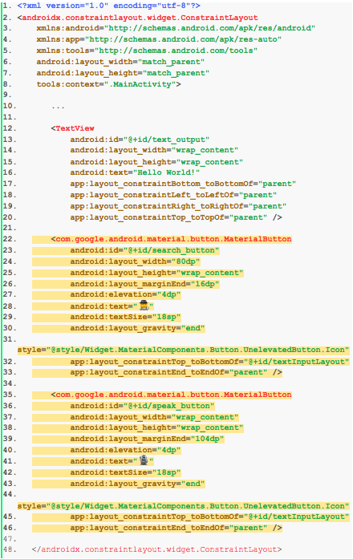

Код, который необходимо добавить, вы можете скопировать здесь:
```xml
    <com.google.android.material.button.MaterialButton
        android:id="@+id/search_button"
        android:layout_width="80dp"
        android:layout_height="wrap_content"
        android:layout_marginEnd="16dp"
        android:elevation="4dp"
        android:text="🕵️‍"
        android:textSize="18sp"
        android:layout_gravity="end"
        style="@style/Widget.MaterialComponents.Button.UnelevatedButton.Icon"
        app:layout_constraintTop_toBottomOf="@+id/textInputLayout"
        app:layout_constraintEnd_toEndOf="parent" />
 
    <com.google.android.material.button.MaterialButton
        android:id="@+id/speak_button"
        android:layout_width="wrap_content"
        android:layout_height="wrap_content"
        android:layout_marginEnd="104dp"
        android:elevation="4dp"
        android:text="🎙️"
        android:textSize="18sp"
        android:layout_gravity="end"
        style="@style/Widget.MaterialComponents.Button.UnelevatedButton.Icon"
        app:layout_constraintTop_toBottomOf="@+id/textInputLayout"
        app:layout_constraintEnd_toEndOf="parent" />
```

7. Добавьте в приложение краточку для вывода ответа. 

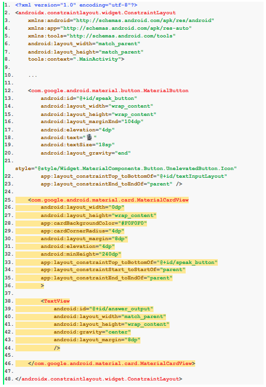

```xml
    <com.google.android.material.card.MaterialCardView
        android:layout_width="0dp"
        android:layout_height="wrap_content"
        app:cardBackgroundColor="#F0F0F0"
        app:cardCornerRadius="4dp"
        android:layout_margin="8dp"
        android:elevation="4dp"
        android:minHeight="240dp"
        app:layout_constraintTop_toBottomOf="@+id/speak_button"
        app:layout_constraintStart_toStartOf="parent"
        app:layout_constraintEnd_toEndOf="parent"
        >
 
        <TextView
            android:id="@+id/answer_output"
            android:layout_width="match_parent"
            android:layout_height="wrap_content"
            android:gravity="center"
            android:layout_margin="8dp"
            />
 
    </com.google.android.material.card.MaterialCardView>
```

8. Удалите стандартное тектовое поле.

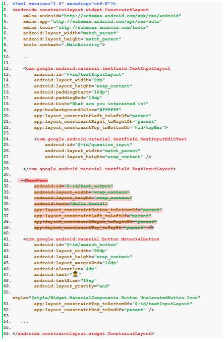

### Итоговый код в файле `activity_main.xml` :

```xml
<?xml version="1.0" encoding="utf-8"?>
<androidx.constraintlayout.widget.ConstraintLayout
    xmlns:android="http://schemas.android.com/apk/res/android"
    xmlns:app="http://schemas.android.com/apk/res-auto"
    android:layout_width="match_parent"
    android:layout_height="match_parent">
 
    <com.google.android.material.appbar.AppBarLayout
        android:id="@+id/topBar"
        app:layout_constraintTop_toTopOf="parent"
        android:layout_width="match_parent"
        android:layout_height="wrap_content"
        >
 
        <com.google.android.material.appbar.MaterialToolbar
            android:id="@+id/topAppBar"
            style="@style/Widget.MaterialComponents.Toolbar.Primary"
            android:layout_width="match_parent"
            android:layout_height="?attr/actionBarSize"
            app:title="Netology Voice Assistant" />
 
    </com.google.android.material.appbar.AppBarLayout>
 
    <com.google.android.material.textfield.TextInputLayout
        android:id="@+id/textInputLayout"
        android:layout_width="0dp"
        android:layout_height="wrap_content"
        android:paddingStart="16dp"
        android:paddingEnd="16dp"
        android:hint="What are you interested in?"
        app:boxBackgroundColor="#ffffff"
        app:layout_constraintLeft_toLeftOf="parent"
        app:layout_constraintRight_toRightOf="parent"
        app:layout_constraintTop_toBottomOf="@id/topBar">
 
        <com.google.android.material.textfield.TextInputEditText
            android:id="@+id/question_input"
            android:layout_width="match_parent"
            android:layout_height="wrap_content" />
 
    </com.google.android.material.textfield.TextInputLayout>
 
    <com.google.android.material.button.MaterialButton
        android:id="@+id/search_button"
        android:layout_width="80dp"
        android:layout_height="wrap_content"
        android:layout_marginEnd="16dp"
        android:elevation="4dp"
        android:text="🕵️‍"
        android:textSize="18sp"
        android:layout_gravity="end"
        style="@style/Widget.MaterialComponents.Button.UnelevatedButton.Icon"
        app:layout_constraintTop_toBottomOf="@+id/textInputLayout"
        app:layout_constraintEnd_toEndOf="parent" />
 
    <com.google.android.material.button.MaterialButton
        android:id="@+id/speak_button"
        android:layout_width="wrap_content"
        android:layout_height="wrap_content"
        android:layout_marginEnd="104dp"
        android:elevation="4dp"
        android:text="🎙️"
        android:textSize="18sp"
        android:layout_gravity="end"
        style="@style/Widget.MaterialComponents.Button.UnelevatedButton.Icon"
        app:layout_constraintTop_toBottomOf="@+id/textInputLayout"
        app:layout_constraintEnd_toEndOf="parent" />
 
    <com.google.android.material.card.MaterialCardView
        android:layout_width="0dp"
        android:layout_height="wrap_content"
        app:cardBackgroundColor="#F0F0F0"
        app:cardCornerRadius="4dp"
        android:layout_margin="8dp"
        android:elevation="4dp"
        android:minHeight="240dp"
        app:layout_constraintTop_toBottomOf="@+id/speak_button"
        app:layout_constraintStart_toStartOf="parent"
        app:layout_constraintEnd_toEndOf="parent"
        >
 
        <TextView
            android:id="@+id/answer_output"
            android:layout_width="match_parent"
            android:layout_height="wrap_content"
            android:gravity="center"
            android:layout_margin="8dp"
            />
 
    </com.google.android.material.card.MaterialCardView>
 
</androidx.constraintlayout.widget.ConstraintLayout>
```

## Задание 3
Перенесите поле ввода и кнопки в верхнюю панель и добавьте анимацию скрытия верхней панели. Ваше приложение будет выглядеть так:


### Инструкция

1. Для начала добавьте новые контейнеры. Именно для этого типа анимаций есть специальный контейнер - `CoordinatiorLayout`. Замените корневой контейнер `ConstraintLayout` на новый `CoordinatorLayout` . Добавьте библиотеку `androidx.coordinatorlayou`.

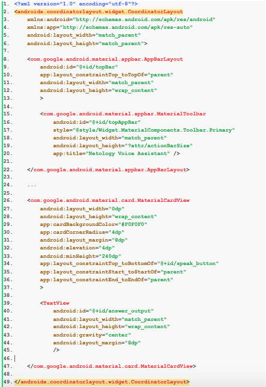


2. Добавьте верхней панели возможность сворачиваться. Для этого увеличьте ее высоту да 176dp и оберните элемент MaterialToolbar в контейнер CollapsingToolbarLayout. Это встроенный метод анимации верхней панели. Добавьть верхний отступ к полю вывода ответа.

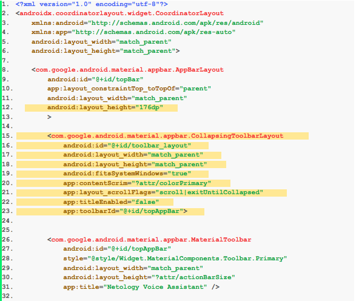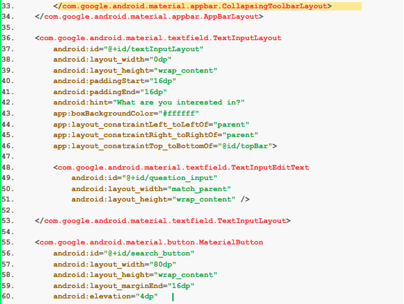
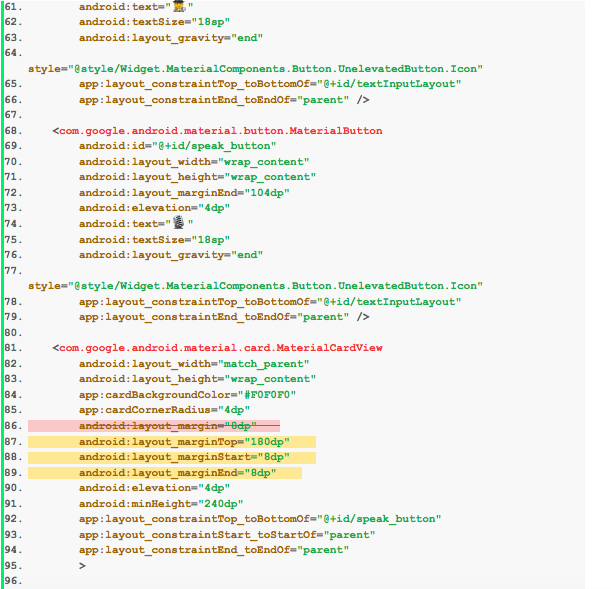
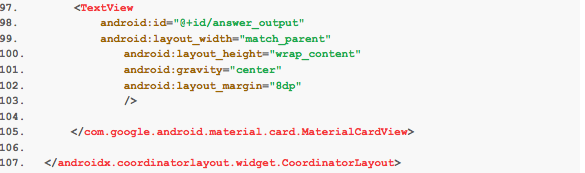

3. Измените внешний вид верхней панели с помощью следующих преобразований: 

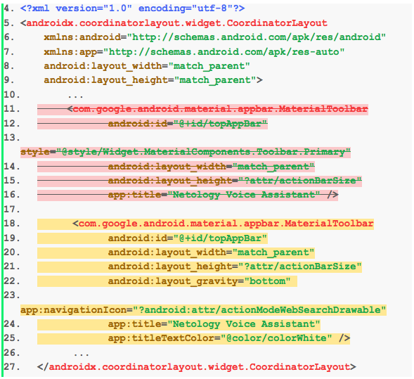

3. На время удалите поле ввода и кнопки, чтобы позже добавить их в верхнюю панель. 

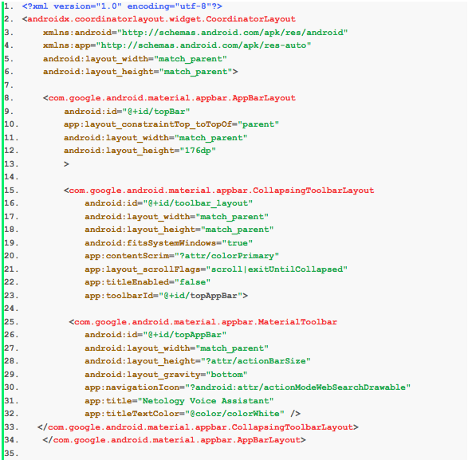
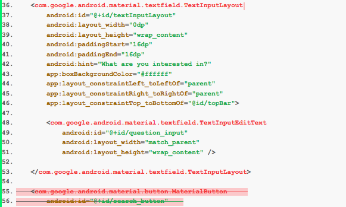
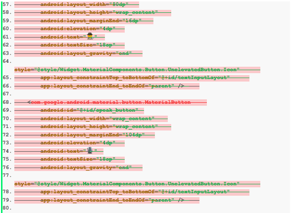
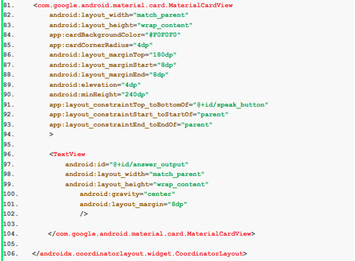


Вот так выглядит приложение на данном этапе:

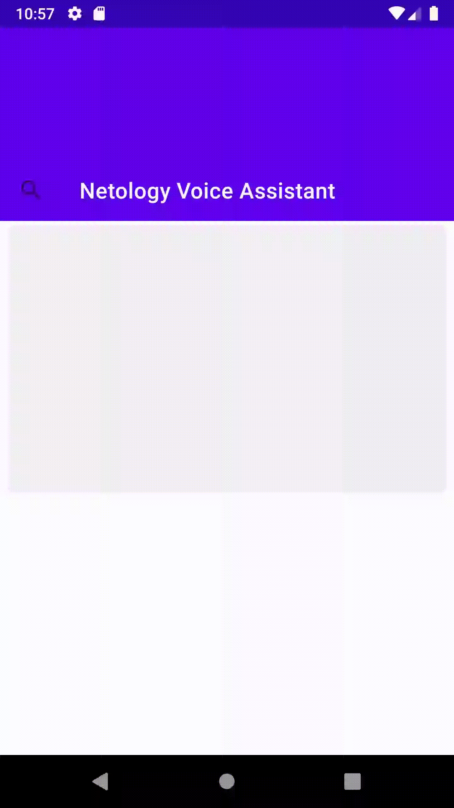


 4. Добавьте анимацию - поле ответа должно двигаться вместе с верхней панелью. Для этого оберните `CardView` в элемент `androidx.core.widget.NestedScrollView` с параметром `app:layout_behavior="@string/appbar_scrolling_view_behavior"`. Уберите верхний отступ у `CardView`. Наличие такого элемента вместе с `CollapsingToolbarLayout` внутри `CoordinatorLayout` автоматически добавит нужную анимацию.
 
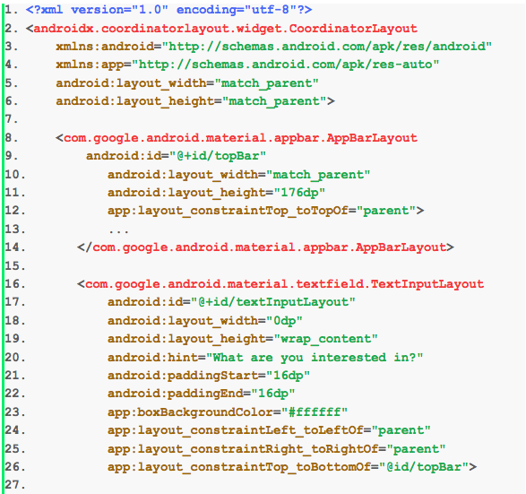
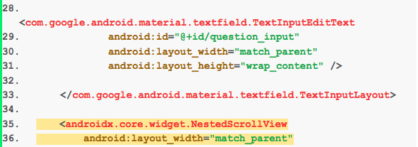
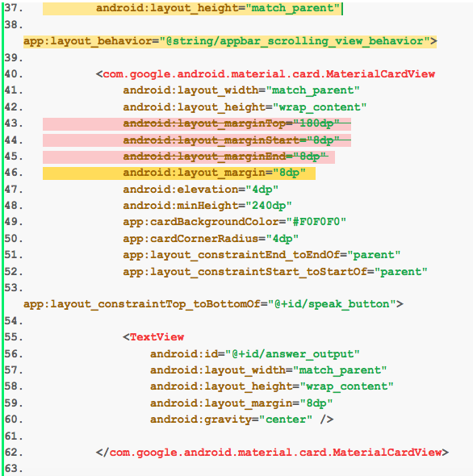
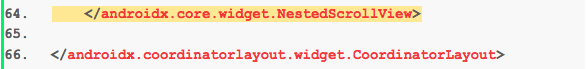

Вот так выглядит приложение на данном этапе:

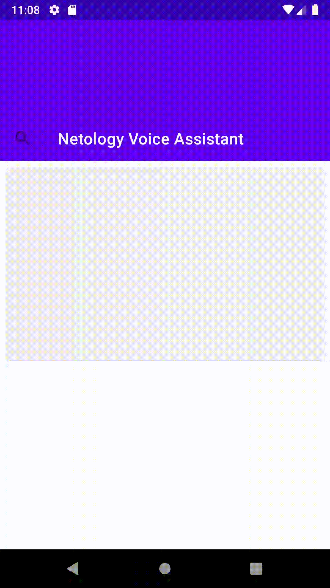


5. Теперь осталось добавить поле ввода и кнопки в верхнюю панель. `CollapsingToolbarLayout` - это контейнер. Переместите поле ввода в него и добавьте кнопки.

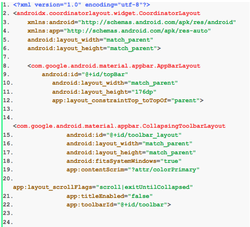

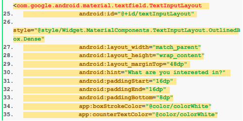

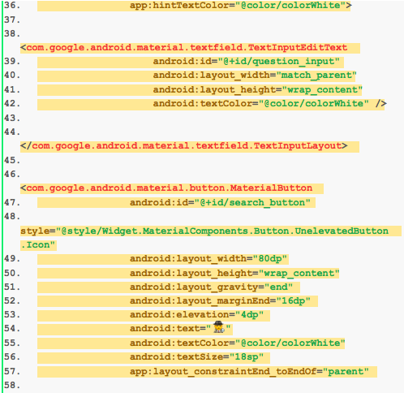

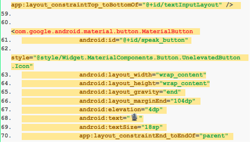

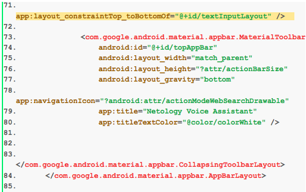

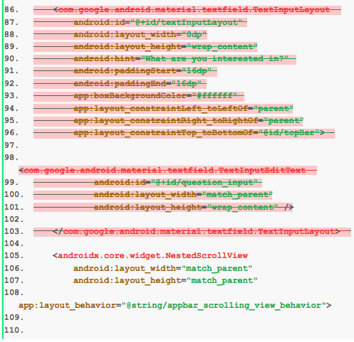

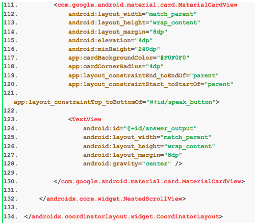


Итоговый код:

```xml
<?xml version="1.0" encoding="utf-8"?>
<androidx.coordinatorlayout.widget.CoordinatorLayout 
    xmlns:android="http://schemas.android.com/apk/res/android"
    xmlns:app="http://schemas.android.com/apk/res-auto"
    android:layout_width="match_parent"
    android:layout_height="match_parent">

    <com.google.android.material.appbar.AppBarLayout
        android:layout_width="match_parent"
        android:layout_height="176dp"
        android:elevation="4dp"
        android:focusableInTouchMode="true">

        <com.google.android.material.appbar.CollapsingToolbarLayout
            android:id="@+id/toolbar_layout"
            android:layout_width="match_parent"
            android:layout_height="match_parent"
            android:fitsSystemWindows="true"
            app:contentScrim="?attr/colorPrimary"
            app:layout_scrollFlags="scroll|exitUntilCollapsed"
            app:titleEnabled="false"
            app:toolbarId="@+id/toolbar">

            <com.google.android.material.textfield.TextInputLayout
                android:id="@+id/textInputLayout"
                style="@style/Widget.MaterialComponents.TextInputLayout.OutlinedBox.Dense"
                android:layout_width="match_parent"
                android:layout_height="wrap_content"
                android:layout_marginTop="48dp"
                android:hint="What are you interested in?"
                android:paddingStart="16dp"
                android:paddingEnd="16dp"
                android:paddingBottom="8dp"
                app:boxStrokeColor="@color/colorWhite"
                app:counterTextColor="@color/colorWhite"
                app:hintTextColor="@color/colorWhite">

                <com.google.android.material.textfield.TextInputEditText
                    android:id="@+id/question_input"
                    android:layout_width="match_parent"
                    android:layout_height="wrap_content"
                    android:textColor="@color/colorWhite" />

            </com.google.android.material.textfield.TextInputLayout>

            <com.google.android.material.button.MaterialButton
                android:id="@+id/search_button"
                style="@style/Widget.MaterialComponents.Button.UnelevatedButton.Icon"
                android:layout_width="80dp"
                android:layout_height="wrap_content"
                android:layout_gravity="end"
                android:layout_marginEnd="16dp"
                android:elevation="4dp"
                android:text="🕵️‍"
                android:textColor="@color/colorWhite"
                android:textSize="18sp"
                app:layout_constraintEnd_toEndOf="parent"
                app:layout_constraintTop_toBottomOf="@+id/textInputLayout" />

            <com.google.android.material.button.MaterialButton
                android:id="@+id/speak_button"
                style="@style/Widget.MaterialComponents.Button.UnelevatedButton.Icon"
                android:layout_width="wrap_content"
                android:layout_height="wrap_content"
                android:layout_gravity="end"
                android:layout_marginEnd="104dp"
                android:elevation="4dp"
                android:text="🎙️"
                android:textSize="18sp"
                app:layout_constraintEnd_toEndOf="parent"
                app:layout_constraintTop_toBottomOf="@+id/textInputLayout" />

            <com.google.android.material.appbar.MaterialToolbar
                android:id="@+id/topAppBar"
                android:layout_width="match_parent"
                android:layout_height="?attr/actionBarSize"
                android:layout_gravity="bottom"
                app:navigationIcon="?android:attr/actionModeWebSearchDrawable"
                app:title="Netology Voice Assistant"
                app:titleTextColor="@color/colorWhite" />

        </com.google.android.material.appbar.CollapsingToolbarLayout>
    </com.google.android.material.appbar.AppBarLayout>

    <androidx.core.widget.NestedScrollView
        android:layout_width="match_parent"
        android:layout_height="match_parent"
        app:layout_behavior="@string/appbar_scrolling_view_behavior">

        <com.google.android.material.card.MaterialCardView
            android:layout_width="match_parent"
            android:layout_height="wrap_content"
            android:layout_marginStart="8dp"
            android:layout_marginTop="8dp"
            android:layout_marginEnd="8dp"
            android:elevation="4dp"
            android:minHeight="240dp"
            app:cardBackgroundColor="#F0F0F0"
            app:cardCornerRadius="4dp">

            <TextView
                android:id="@+id/answer_output"
                android:layout_width="match_parent"
                android:layout_height="wrap_content"
                android:layout_margin="8dp"
                android:gravity="center" />

        </com.google.android.material.card.MaterialCardView>

    </androidx.core.widget.NestedScrollView>

</androidx.coordinatorlayout.widget.CoordinatorLayout>

```

Окончательный вид приложения: 


Любые вопросы по решению задач задавайте в чате в Telegram.
