# Домашнее задание к занятию 3. Взаимодействие со сторонними сервисами 
Для получения коротких текстовых ответов на текстовые вопросы существует удобный сервис от Wolfram Alpha, а именно [Short Answer API](https://products.wolframalpha.com/simple-api/documentation/). В этом домашнем задании вам необходимо добавить взаимодействие с этим сервисом в ваше приложение.
 

## Задание 1
Зарегистрируйтесь как разработчик в Wolfram Alpha по [ссылке](https://account.wolfram.com/login/create).

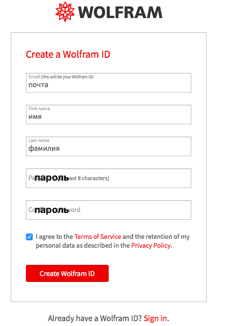

Затем получите AppID. Для этого перейдите по [ссылке](https://developer.wolframalpha.com/portal/myapps/index.html), нажмите **Get an AppID**. Обратите внимание, что после получения AppID надо подождать несколько часов, прежде чем он начнёт работать.

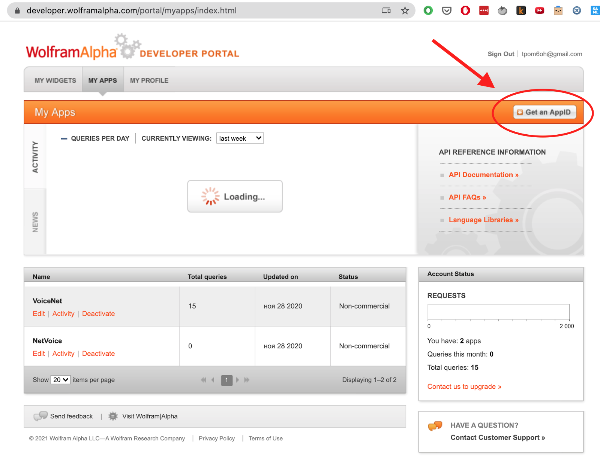

## Задание 2
Добавьте **Wolfram Alpha SDK** в проект.

### Инструкция
1.Перейдите на [страницу библиотек Wolfram Alpha.](https://products.wolframalpha.com/api/libraries.html) Выберите Java. Нажмите Download. После этого должен скачаться zip-архив. Внутри несколько файлов, в том числе файл с расширением `jar`.

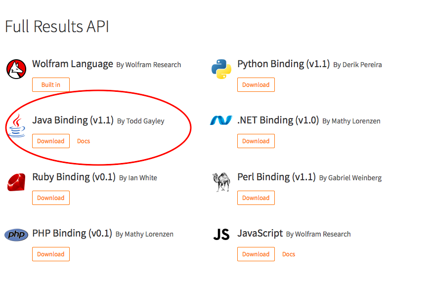

2. Поместите файл библиотеки `WolframAlpha-1.1.jar` в папку `libs`.

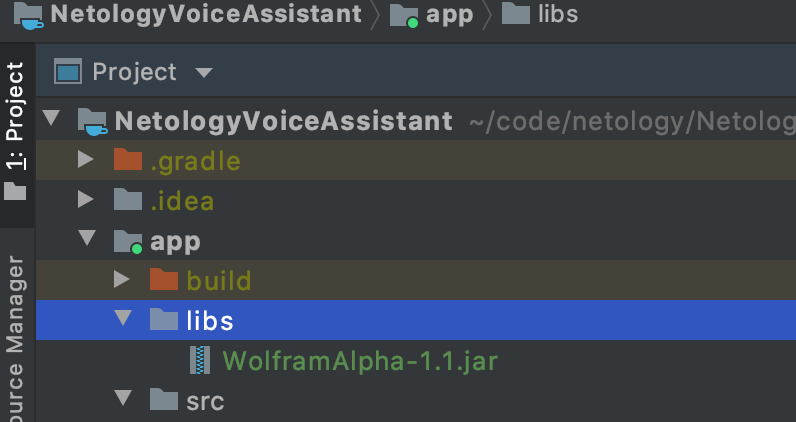

3. Добавьте папку `libs` как источник библиотек (если этого еще не сделано). Для этого откройте файл `build.gradle` в модуле `app`. Воспользуйтесь поиском (двойное нажатие на Shift), на этот раз по файлам. Введите `build.gradle` и выберите тот, около которого написано `app`. Там находится список всех библиотек проекта.

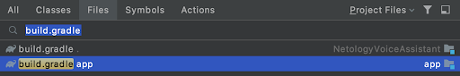

4. Проверьте, есть ли в файле `build.gradle` в блоке `dependencies` упоминание папки `lib`: 
```
implementation fileTree(dir: "libs", include: ["*.jar"])
```
Если такой строки нет, то добавьте её:

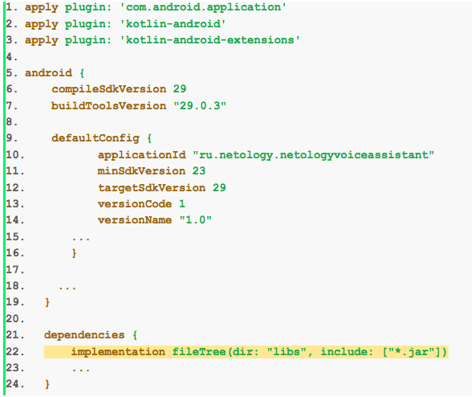

5. Запустите действие `Sync Project with Gradle Files` из поиска (2 * Shift), чтобы обновить зависимости и подключить библиотеку.

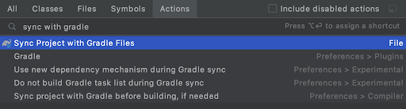

6. Включите поддержку http и старой библиотеки. Для этого в файле `AndroidManifest.xml` добавьте строки 

```xml
android:usesCleartextTraffic="true"
```
и 

```xml
<uses-library android:name="org.apache.http.legacy" android:required="false"/>
```

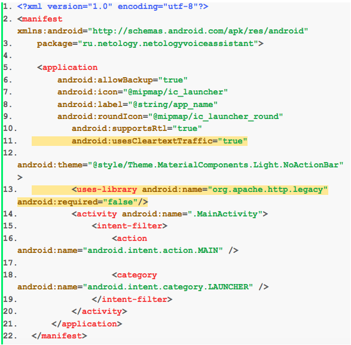


## Задание 3

Реализуйте возможность задавать вопросы и получать ответы через **Wolfram Alpha** в вашем приложении.


### Инструкция

1. Добавьте в приложение запрос разрешения на доступ в интернет. Для этого добавьте следующий код (выделен жёлтым) в файл `AndroidManifest.xml`. 

```xml
<uses-permission android:name="android.permission.INTERNET"/>
```

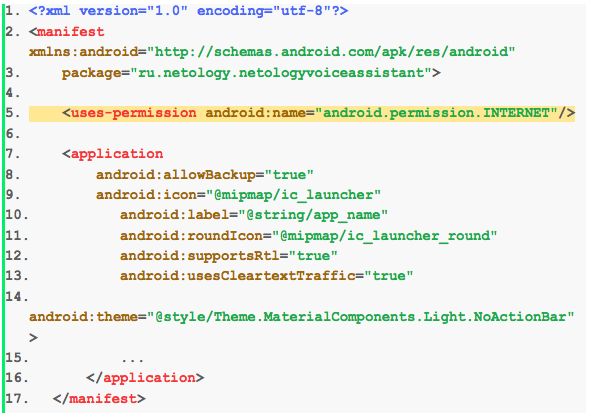

2. Импортируйте библиотеку `WolframAlpha` в файле `MainActivity.kt`. 

```kotlin
import com.wolfram.alpha.WAEngine
import com.wolfram.alpha.WAPlainText
```

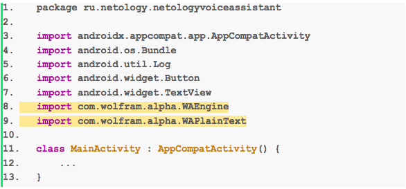

3. Получите доступ к полю ввода вопроса и кнопке отправки вопроса с помощью следующего кода в файле `MainActivity.kt`.

```kotlin
val questionInput = findViewById<TextView>(R.id.question_input)
val searchButton = findViewById<Button>(R.id.search_button)
```

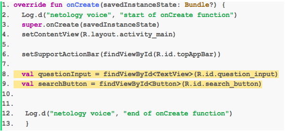

4. Создайте функцию, которая будет получать вопрос и выводить ответ в logcat.

Функция: 
```kotlin
     fun askWolfram(question: String) {
      val wolframAppId = "DEMO" // change to your App Id
 
    val engine = WAEngine()
    engine.appID = wolframAppId
    engine.addFormat("plaintext")
 
    val query = engine.createQuery()
    query.input = question
 
    Thread(Runnable {
      val queryResult = engine.performQuery(query)
      if (queryResult.isError) {
        Log.e("wolfram error", queryResult.errorMessage)
      } else if (!queryResult.isSuccess) {
        Log.e("wolfram error", "Sorry, I don't understand, can you rephrase?")
      } else {
         for (pod in queryResult.pods) {
           if (!pod.isError) {
             for (subpod in pod.subpods) {
               for (element in subpod.contents) {
                 if (element is WAPlainText) {
                   Log.d("wolfram", element.text)
                 }
               }
             }
           }
         }
       }
    }).start()
  }
```

Расположение функции в коде файла `MainActivity.kt`.

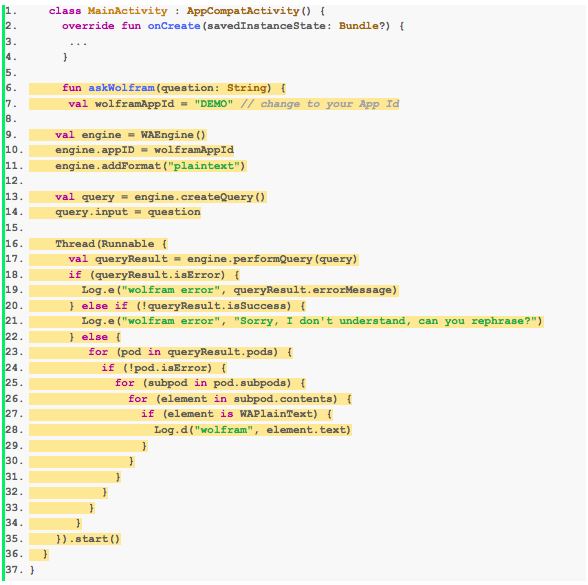

5. Реализуйте функционал вызова функции при нажатии на кнопку 🕵️‍(человек с лупой) с помощью `setOnClickListener`.

```kotlin
 searchButton.setOnClickListener {
    askWolfram(questionInput.text.toString())
 }
```

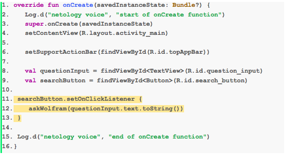

6. Измените приложение так, чтобы ответ на вопрос пользователя выводился в текстовом поле. 

Изменения в функции `askWolfram` выделены жёлтым цветом.

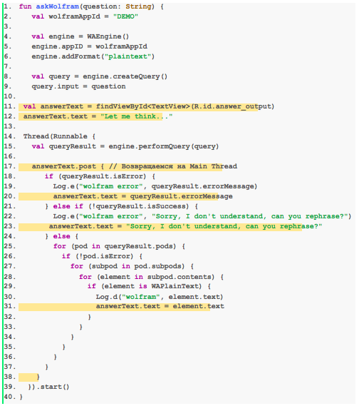

В итоге функция `askWolfram` выглядит следующим образом:

```kotlin
fun askWolfram(question: String) {
   val wolframAppId = "DEMO"
 
   val engine = WAEngine()
   engine.appID = wolframAppId
   engine.addFormat("plaintext")
 
   val query = engine.createQuery()
   query.input = question
 
 val answerText = findViewById<TextView>(R.id.answer_output)
 answerText.text = "Let me think..."
 
 Thread(Runnable {
   val queryResult = engine.performQuery(query)
 
   answerText.post { // Возвращаемся на Main Thread
      if (queryResult.isError) {
        Log.e("wolfram error", queryResult.errorMessage)
        answerText.text = queryResult.errorMessage
      } else if (!queryResult.isSuccess) {
        Log.e("wolfram error", "Sorry, I don't understand, can you rephrase?")
       answerText.text = "Sorry, I don't understand, can you rephrase?"
      } else {
        for (pod in queryResult.pods) {
          if (!pod.isError) {
            for (subpod in pod.subpods) {
              for (element in subpod.contents) {
                if (element is WAPlainText) {
                  Log.d("wolfram", element.text)
                  answerText.text = element.text
                }
              }
            }
          }
        }
      }
    }
  }).start()
}
```

## Задание 4 (дополнительное задание)

Добавьте возможность выделить и копировать текст ответа от **Wolfram Alpha** в вашем приложении. 

### Инструкция 

Добавьте параметр `android:textIsSelectable="true"`  к `TextView`, в который выводится ответ, в файл `activity_main.xml`.

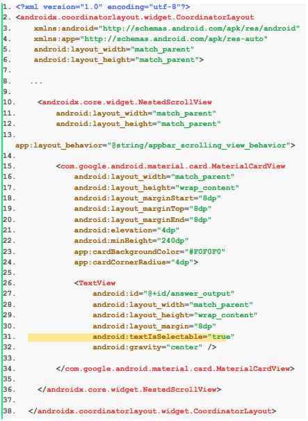


Любые вопросы по решению задач задавайте в чате в Telegram.
