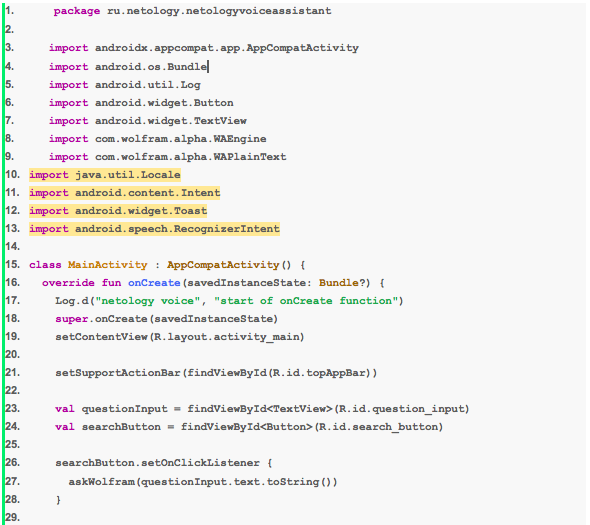
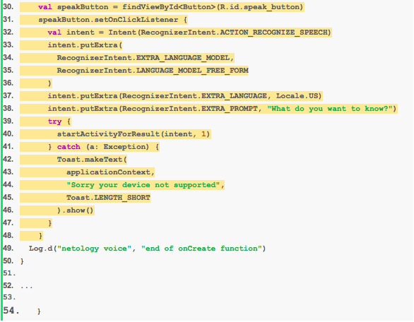
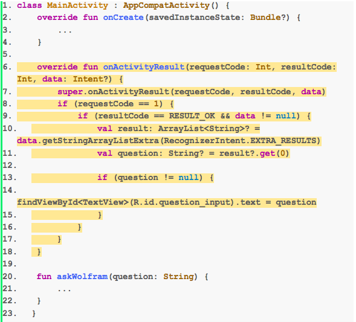
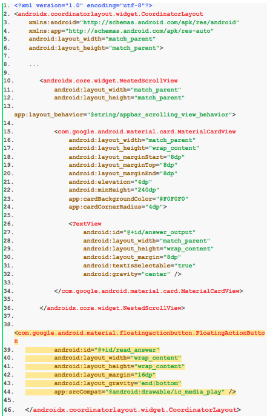
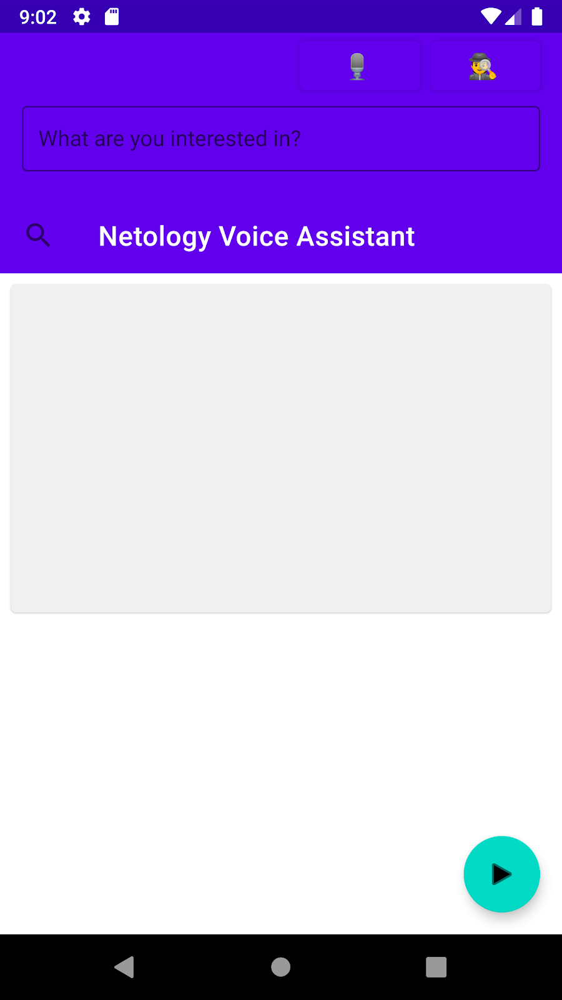
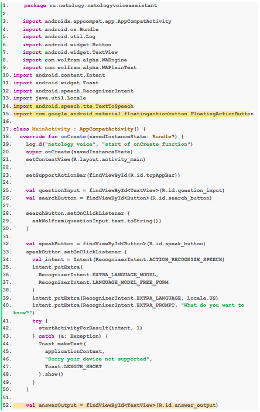
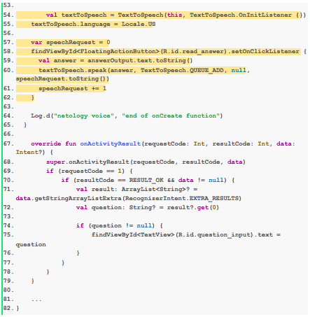
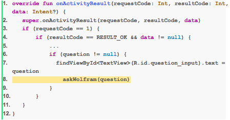
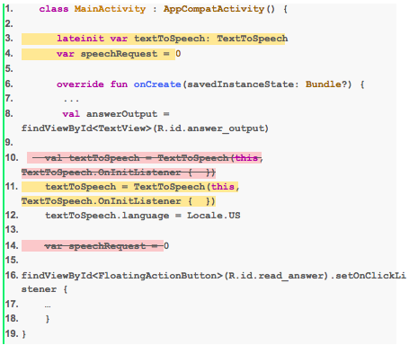
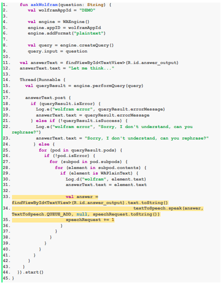

# Домашнее задание к занятию 4. Добавление голосового интерфейса

Взаимодействовать с приложением можно не только нажатием клавиш, но и с помощью голоса. Если вы занимаетесь какими-то делами или находитесь в дороге, куда удобнее и быстрее произнести свой вопрос, чем печатать его. Вероятно, владельцы смарт-устройств, управляемых голосом, уже оценили это преимущество. В рамках этого домашнего задания предлагаем вам добавить голосовой интерфейс в ваше приложение. 

## Задание 1
Запустите приложение на реальном устройстве под операционной системой Android. Функция распознавания голоса не всегда работает на эмуляторе.

Инструкция доступна по [ссылке](https://github.com/netology-code/guides/blob/master/android/device/instruction.md).

## Задание 2
Реализуйте функцию распознавания голоса в вашем приложении.

### Инструкция

1. Сначала добавьте отправку запроса в систему на распознавание голоса в приложении. Для этого откройте файл `MainActivity.kt`.

1.1. Создайте сам запрос, для этого создайте класс `Intent`. Конструктору класса передайте действие — распознавание речи (`ACTION_RECOGNIZE_SPEECH`). 

```Kotlin
val intent = Intent(RecognizerIntent.ACTION_RECOGNIZE_SPEECH)
```

Добавьте информацию о языке — Wolfram Alpha отвечает на вопросы на английском, поэтому установите `Locale.US`.

```Kotlin
intent.putExtra(
   RecognizerIntent.EXTRA_LANGUAGE_MODEL,
   RecognizerIntent.LANGUAGE_MODEL_FREE_FORM
)
intent.putExtra(RecognizerIntent.EXTRA_LANGUAGE, Locale.US)
```

Установите сообщение, которое будет показываться перед распознаванием голоса:

```Kotlin
intent.putExtra(RecognizerIntent.EXTRA_PROMPT, "What do you want to know?")
```

1.2. Отправьте запрос в систему с помощью метода `startActivityForResult`.

```Kotlin
try {
   startActivityForResult(intent, speechToTextRequestCode)
} catch (a: ActivityNotFoundException) {
   Toast.makeText(
       applicationContext,
       "Sorry your device not supported",
       Toast.LENGTH_SHORT
   ).show()
}
```

1.3. Установите это действие на нажатие на кнопку `speak_button` , этот код поместите в `onCreate` сразу после обработчика кнопки `searchButton`.

```Kotlin
val speakButton = findViewById<Button>(R.id.speak_button)
speakButton.setOnClickListener {
   val intent = Intent(RecognizerIntent.ACTION_RECOGNIZE_SPEECH)
   intent.putExtra(
       RecognizerIntent.EXTRA_LANGUAGE_MODEL,
       RecognizerIntent.LANGUAGE_MODEL_FREE_FORM
   )
   intent.putExtra(RecognizerIntent.EXTRA_LANGUAGE, Locale.US)
   intent.putExtra(RecognizerIntent.EXTRA_PROMPT, "What do you want to know?")
   try {
       startActivityForResult(intent, 1)
   } catch (a: ActivityNotFoundException) {
       Toast.makeText(
           applicationContext,
           "Sorry your device not supported",
           Toast.LENGTH_SHORT
       ).show()
   }
}
```

Итоговый код в файле `MainActivity.kt`:

 
 

2. Получите результат распознавания и запишите его в текстовое поле.

Для получения ответа используйте функцию:

```Kotlin
override fun onActivityResult(requestCode: Int, resultCode: Int, data: Intent?) {
...
}
```

Сначала вызовите системную реализацию этого метода через `super.onActivityResult(requestCode, resultCode, data)` . Затем проверьте, на ваш ли запрос пришёл ответ: 

```Kotlin
startActivityForResult(intent, 1)
```

Дальше проверьте, удачно ли выполнился запрос и есть ли какая-то информация в ответе:

```Kotlin
resultCode == RESULT_OK && data != null
```

Если все эти условия выполняются, то результат получается из ответного Intent:

```Kotlin
val result: ArrayList<String>? = data.getStringArrayListExtra(RecognizerIntent.EXTRA_RESULTS)
val question: String? = result?.get(0)
```

Его нужно вывести в текстовое поле вопроса:
```Kotlin
if (question != null) {
       findViewById<TextView>(R.id.question_input).text = question
}
```

 

## Задание 3

Реализуйте функцию голосового воспроизведения ответа.

### Инструкция

1. Добавьте кнопку для воспроизведения ответа. Откройте файл `activity_main.xml`. Добавьте следующий код: 

```xml
<com.google.android.material.floatingactionbutton.FloatingActionButton
        android:id="@+id/read_answer"
        android:layout_width="wrap_content"
        android:layout_height="wrap_content"
        android:layout_margin="16dp"
        android:layout_gravity="end|bottom"
        app:srcCompat="@android:drawable/ic_media_play" />
```

 

Теперь приложение будет выглядеть следующим образом: 



2. Переведите ответ из текста в голос. Откройте файл `MainActivity.kt`. Добавьте следующий код:

Итоговый код вы можете скопировать здесь:

```Kotlin
package ru.netology.netologyvoiceassistant
 
import androidx.appcompat.app.AppCompatActivity
import android.os.Bundle
import android.util.Log
import android.widget.Button
import android.widget.TextView
import com.wolfram.alpha.WAEngine
import com.wolfram.alpha.WAPlainText
import android.content.Intent
import android.widget.Toast
import android.speech.RecognizerIntent
import java.util.Locale
import android.speech.tts.TextToSpeech
import com.google.android.material.floatingactionbutton.FloatingActionButton
 
class MainActivity : AppCompatActivity() {
  override fun onCreate(savedInstanceState: Bundle?) {
    Log.d("netology voice", "start of onCreate function")
    super.onCreate(savedInstanceState)
    setContentView(R.layout.activity_main)
 
    setSupportActionBar(findViewById(R.id.topAppBar))
 
    val questionInput = findViewById<TextView>(R.id.question_input)
    val searchButton = findViewById<Button>(R.id.search_button)
 
    searchButton.setOnClickListener {
      askWolfram(questionInput.text.toString())
    }
 
    val speakButton = findViewById<Button>(R.id.speak_button)
    speakButton.setOnClickListener {
      val intent = Intent(RecognizerIntent.ACTION_RECOGNIZE_SPEECH)
      intent.putExtra(
        RecognizerIntent.EXTRA_LANGUAGE_MODEL,
        RecognizerIntent.LANGUAGE_MODEL_FREE_FORM
      )
      intent.putExtra(RecognizerIntent.EXTRA_LANGUAGE, Locale.US)
      intent.putExtra(RecognizerIntent.EXTRA_PROMPT, "What do you want to know?")
      try {
        startActivityForResult(intent, 1)
      } catch (a: Exception) {
        Toast.makeText(
          applicationContext,
          "Sorry your device not supported",
          Toast.LENGTH_SHORT
        ).show()
      }
    }
 
    val answerOutput = findViewById<TextView>(R.id.answer_output)
 
        val textToSpeech = TextToSpeech(this, TextToSpeech.OnInitListener {})
    textToSpeech.language = Locale.US
 
    var speechRequest = 0
    findViewById<FloatingActionButton>(R.id.read_answer).setOnClickListener {
      val answer = answerOutput.text.toString()
      textToSpeech.speak(answer, TextToSpeech.QUEUE_ADD, null, speechRequest.toString())
      speechRequest += 1
    }
 
    Log.d("netology voice", "end of onCreate function")
  }
 
    override fun onActivityResult(requestCode: Int, resultCode: Int, data: Intent?) {
        super.onActivityResult(requestCode, resultCode, data)
        if (requestCode == 1) {
            if (resultCode == RESULT_OK && data != null) {
                val result: ArrayList<String>? = data.getStringArrayListExtra(RecognizerIntent.EXTRA_RESULTS)
                val question: String? = result?.get(0)
 
                if (question != null) {
                    findViewById<TextView>(R.id.question_input).text = question
                }
            }
        }
    }
 
    ...
}
```





## Задание 4 (дополнительное задание)
Добавьте автоматический запуск поиска с результатом распознавания и автоматический запуск чтения результата.

### Инструкция

1. Реализуйте автоматический запуск поиска с результатом распознавания. Для этого запустите функцию `askWolfram` внутри `onActivityResult` автоматически, сразу после записи вопроса в текстовое поле.

```Kotlin
askWolfram(question)    
```



2. Реализуйте автоматический запуск чтения результата. Для этого дайте доступ к переменной `textToSpeech` функции `askWolfram`.Вынесите объявление переменной `textToSpeech` на уровень функций — непосредственно внутри фигурных скобок после `class MainActivity : AppCompatActivity()`. 



3. Теперь в `askWolfram` запускайте чтение сразу при получении ответа.



Итоговый код в файле `MainActivity.kt`: 


```Kotlin
package ru.netology.netologyvoiceassistant

import android.content.ActivityNotFoundException
import android.content.Intent
import androidx.appcompat.app.AppCompatActivity
import android.os.Bundle
import android.speech.RecognizerIntent
import android.speech.tts.TextToSpeech
import android.util.Log
import android.widget.Button
import android.widget.TextView
import android.widget.Toast
import com.google.android.material.floatingactionbutton.FloatingActionButton
import com.wolfram.alpha.WAEngine
import com.wolfram.alpha.WAPlainText
import java.util.*

class MainActivity : AppCompatActivity() {

    lateinit var textToSpeech: TextToSpeech
    var speechRequest = 0

    override fun onCreate(savedInstanceState: Bundle?) {
        Log.d("netology voice", "start of onCreate function")
        super.onCreate(savedInstanceState)
        setContentView(R.layout.activity_main)

        setSupportActionBar(findViewById(R.id.topAppBar))

        val questionInput = findViewById<TextView>(R.id.question_input)
        val searchButton = findViewById<Button>(R.id.search_button)

        searchButton.setOnClickListener {
            askWolfram(questionInput.text.toString())
        }

        val speakButton = findViewById<Button>(R.id.speak_button)
        speakButton.setOnClickListener {
            val intent = Intent(RecognizerIntent.ACTION_RECOGNIZE_SPEECH)
            intent.putExtra(
                RecognizerIntent.EXTRA_LANGUAGE_MODEL,
                RecognizerIntent.LANGUAGE_MODEL_FREE_FORM
            )
            intent.putExtra(RecognizerIntent.EXTRA_LANGUAGE, Locale.US)
            intent.putExtra(RecognizerIntent.EXTRA_PROMPT, "What do you want to know?")
            try {
                startActivityForResult(intent, 1)
            } catch (a: ActivityNotFoundException) {
                Toast.makeText(
                    applicationContext,
                    "Sorry your device not supported",
                    Toast.LENGTH_SHORT
                ).show()
            }
        }

        val answerOutput = findViewById<TextView>(R.id.answer_output)

        textToSpeech = TextToSpeech(this, TextToSpeech.OnInitListener {  })
        textToSpeech.language = Locale.US

        findViewById<FloatingActionButton>(R.id.read_answer).setOnClickListener {
            val answer = answerOutput.text.toString()
            textToSpeech.speak(answer, TextToSpeech.QUEUE_ADD, null, speechRequest.toString())
            speechRequest += 1
        }

        Log.d("netology voice", "end of onCreate function")
    }

    override fun onActivityResult(requestCode: Int, resultCode: Int, data: Intent?) {
        super.onActivityResult(requestCode, resultCode, data)
        if (requestCode == 1) {
            if (resultCode == RESULT_OK && data != null) {
                val result: ArrayList<String>? = data.getStringArrayListExtra(RecognizerIntent.EXTRA_RESULTS)
                val question: String? = result?.get(0)

                if (question != null) {
                    findViewById<TextView>(R.id.question_input).text = question
                    askWolfram(question)
                }
            }
        }
    }

    fun askWolfram(question: String) {
        val wolframAppId = "DEMO"

        val engine = WAEngine()
        engine.appID = wolframAppId
        engine.addFormat("plaintext")

        val query = engine.createQuery()
        query.input = question

        val answerText = findViewById<TextView>(R.id.answer_output)
        answerText.text = "Let me think..."

        Thread(Runnable {
            val queryResult = engine.performQuery(query)

            answerText.post {
                if (queryResult.isError) {
                    Log.e("wolfram error", queryResult.errorMessage)
                    answerText.text = queryResult.errorMessage
                } else if (!queryResult.isSuccess) {
                    Log.e("wolfram error", "Sorry, I don't understand, can you rephrase?")
                    answerText.text = "Sorry, I don't understand, can you rephrase?"
                } else {
                    for (pod in queryResult.pods) {
                        if (!pod.isError) {
                            for (subpod in pod.subpods) {
                                for (element in subpod.contents) {
                                    if (element is WAPlainText) {
                                        Log.d("wolfram", element.text)
                                        answerText.text = element.text

                                        val answer = findViewById<TextView>(R.id.answer_output).text.toString()
                                        textToSpeech.speak(answer, TextToSpeech.QUEUE_ADD, null, speechRequest.toString())
                                        speechRequest += 1
                                    }
                                }
                            }
                        }
                    }
                }
            }
        }).start()
    }
}
```

Любые вопросы по решению задач задавайте в чате в Telegram.
